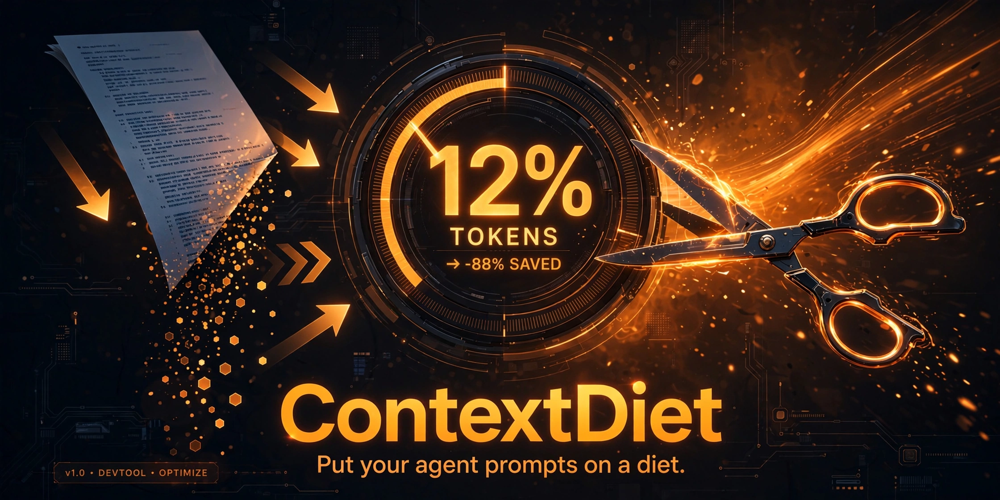

# ContextDiet 🥗

[](LICENSE)
[](https://devilking7x.github.io/contextdiet/)
[](#)

**Analyze what eats your AI agent's context window.** Drop in your `CLAUDE.md`, skill files and `.mcp.json` — get real token counts, a per-file breakdown, actionable trim suggestions, and a before/after savings simulator.

🔴 **Live demo:** https://devilking7x.github.io/contextdiet/

## ✨ Features

- **Real token counting** — uses [`gpt-tokenizer`](https://github.com/niieani/gpt-tokenizer) (browser-compatible BPE) right in your browser. No estimates, no `chars ÷ 4` hacks.
- **Drag & drop** — drop `CLAUDE.md`, `SKILL.md`, `.mcp.json` (or any text/markdown/JSON) and get instant analysis.
- **Per-file breakdown** — ranked table + bar chart, largest offenders first, with kind badges, share-of-total, and inline previews.
- **Context window gauge** — visualizes your % of the window with the **"keep under 20%"** rule marked. Configurable window size (50k / 100k / 200k / 1M / custom).
- **Trim suggestions** — actionable, impact-ordered advice ("this file is 21k tokens — consider splitting into skills"), including cross-file boilerplate deduplication and JSON minification.
- **Before/after simulator** — exclude files and toggle suggestions to see projected token savings before you change a single line.
- **One-click sample bundle** — a chunky `CLAUDE.md`, two skills and an `.mcp.json` so the demo works instantly.
- **100% local-first** — no backend, no uploads, no tracking. Your files never leave the browser. State persists in `localStorage`.

## 🚀 How to use

1. Open the [live demo](https://devilking7x.github.io/contextdiet/).
2. Either **drag & drop** your files, or click **"Try the sample bundle"**.
3. Check the **gauge** — are you under the 20% rule for your model's window?
4. Read the **trim suggestions**, tick the ones you'll act on.
5. Use **Before / after** to preview the savings, then go put your context on a diet.

### Run locally

```bash
pnpm install
pnpm dev        # dev server
pnpm build      # typecheck + production build (dist/)
```

Sample files can be regenerated with `pnpm gen-samples`.

## 🛠 Tech stack

- **TypeScript** + **React 19** + **Vite 7**
- **Tailwind CSS v4** (dark premium UI)
- **gpt-tokenizer** — real BPE token counting, bundled for the browser
- **lucide-react** — icons
- GitHub Pages deploy via Actions (`base: '/contextdiet/'`)

## 📐 How token counting works

Text is encoded with `gpt-tokenizer`'s BPE encoder (the same token family as modern OpenAI models) in 200k-character chunks and summed. Counts are accurate estimates — exact model internals may differ slightly, but they're in the right neighborhood for diet planning.

## 📄 License

MIT — see [LICENSE](LICENSE).
